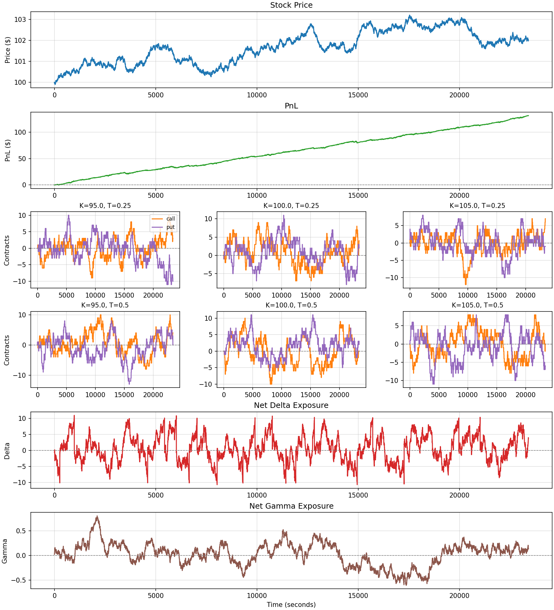
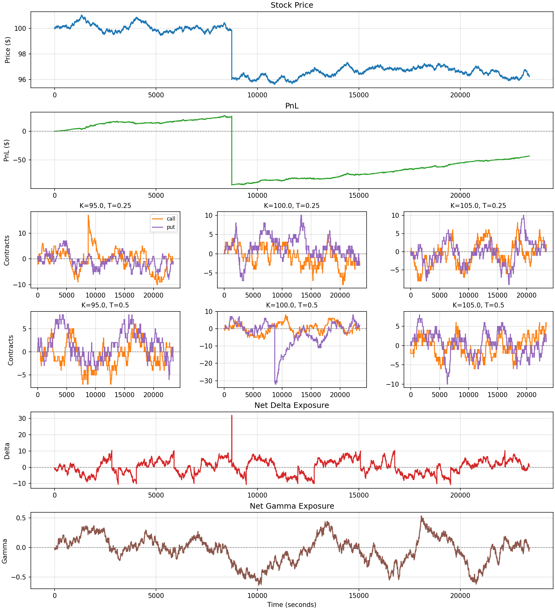
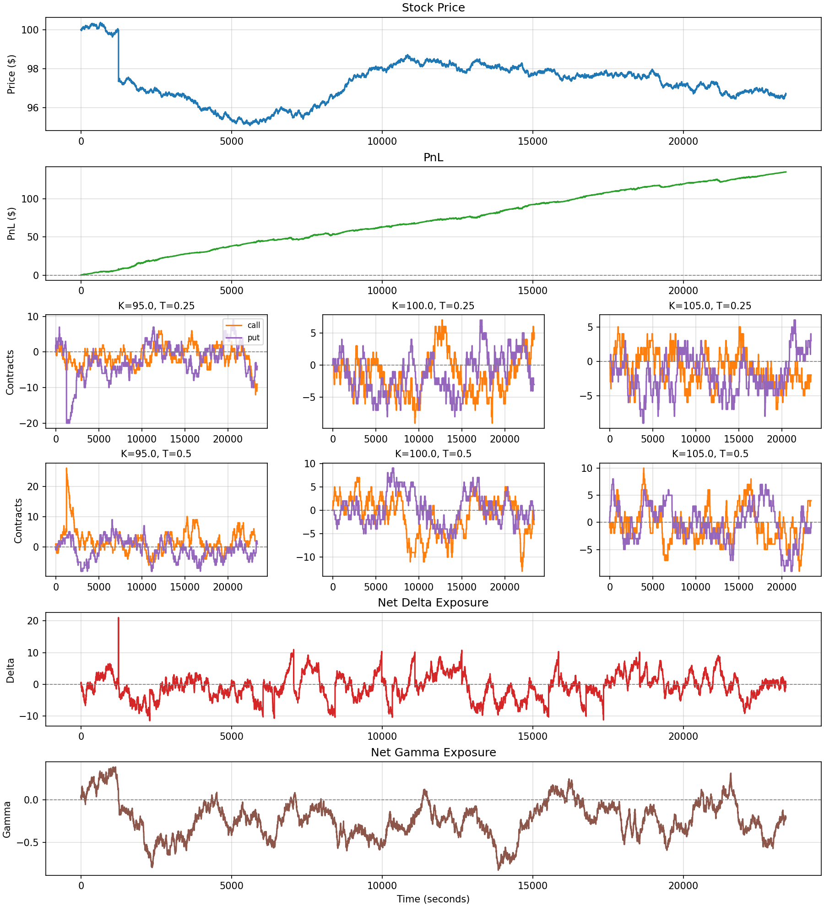

# Market Making Simulation
## Introduction

Simulating a market maker quoting an option with multiple strikes and expiries. 

Market participants consist of uninformed traders and smart money traders. Smart money traders can predict the underlying asset's direction and will place orders according to what they "see". It is possible to tweak the percentage of order flow that comes from smart money and their accuracy.

The market maker prefers to keep its inventory close to a flattened position. It also delta hedges with an execution delay of two seconds. 

It is possible for the underlying asset to experience a jump, and informed traders get a randomized reaction time with a chance to exploit the market maker's delta hedge delay before it can respond.

## Results

### Seed 1
- Jump events: 0
- Final PnL: $131.13 
- Spread PnL: $14.71
- Final Delta: 3.65
- Final Gamma: 0.14



### Seed 5
- Jump events: 1
- Final PnL: -$43.20 
- Spread PnL: $16.57
- Final Delta: 0.55
- Final Gamma: -0.03



### Seed 10
- Jump events: 1
- Final PnL: $134.95 
- Spread PnL: $124.38
- Final Delta: -0.01
- Final Gamma: -0.21



Seed 1 had no jump event and provided insight on what a typical day would look like for the market maker. 

Seed 5 and 10 both had jumps, but PnL varied greatly due to the reaction time mechanic. On seed 5, The informed traders were able to react fast enough to benefit from the market maker's hedge delay. On seed 10, the randomized reaction time was slow enough that the market maker was able to quickly recover from the jump and enjoy a positive PnL. 

## Assumptions

- Order arrival follows a Poisson process
- Fixed volatility skew for each strike 
- No transaction costs or slippage
- No competing market makers

- The market maker's hedge delay is fixed at two seconds, which is unrealistic. Without this delay, the market maker is too powerful and nearly immune to informed traders. 

## How to Run

```
git clone https://github.com/adi-h06/market-making-simulator.git
pip install numpy scipy matplotlib
python main.py
```
